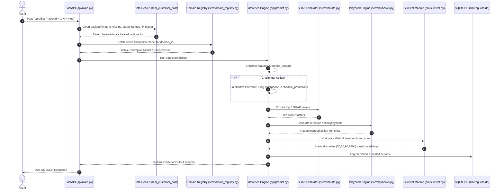
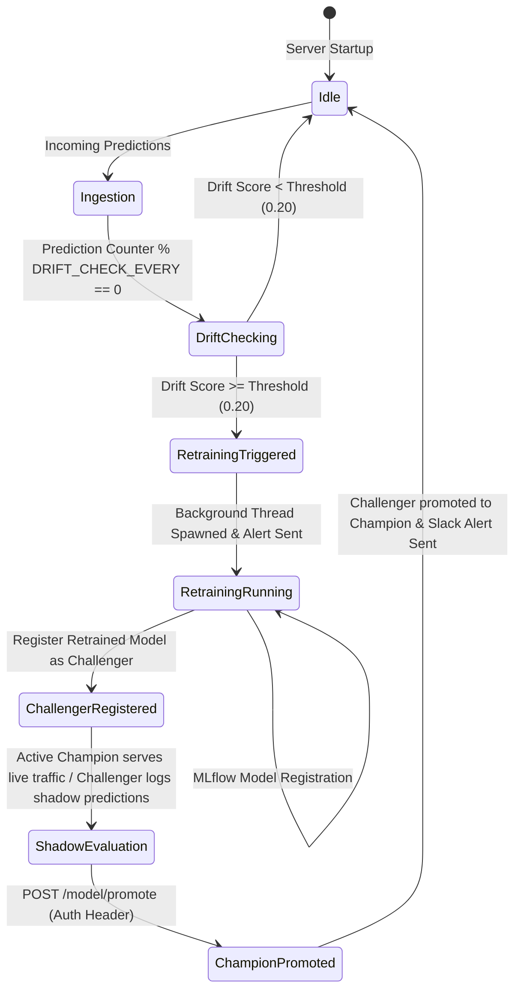

# ChurnGuard: Comprehensive System Architecture, Flow & Logic Guide

This document provides a complete, production-grade technical explanation of **ChurnGuard** — an enterprise multi-domain MLOps microservice platform for churn prediction, retention intervention, probability-derived Weibull time-to-churn estimation, and champion vs. challenger shadow deployment monitoring.

---

## Table of Contents

1. [System Overview & Key Features](#1-system-overview--key-features)
2. [Directory & File Structure](#2-directory--file-structure)
3. [Core Application Data & Logic Flow](#3-core-application-data--logic-flow)
   - [3.1 Data Ingestion & Rule-Based Data Healing](#31-data-ingestion--rule-based-data-healing)
   - [3.2 Feature Engineering & Preprocessing Pipeline](#32-feature-engineering--preprocessing-pipeline)
   - [3.3 Multi-Domain Isolation & Bootstrapping](#33-multi-domain-isolation--bootstrapping)
   - [3.4 Model Inference, SHAP Explainability & Risk Tiering](#34-model-inference-shap-explainability--risk-tiering)
   - [3.5 Automated Retention Action Playbooks Engine](#35-automated-retention-action-playbooks-engine)
   - [3.6 Probability-Derived Weibull Time-to-Churn Estimation](#36-probability-derived-weibull-time-to-churn-estimation)
   - [3.7 Evidently AI Data Drift Monitoring & Webhook Alerts](#37-evidently-ai-data-drift-monitoring--webhook-alerts)
   - [3.8 Continuous Retraining Loop & Pseudo-Labeling Safeguards](#38-continuous-retraining-loop--pseudo-labeling-safeguards)
   - [3.9 Champion vs. Challenger Shadow Deployments & Promotion](#39-champion-vs-challenger-shadow-deployments--promotion)
4. [System Flow Diagrams (Mermaid)](#4-system-flow-diagrams-mermaid)
   - [4.1 End-to-End Prediction Sequence Diagram](#41-end-to-end-prediction-sequence-diagram)
   - [4.2 Self-Healing Retraining & Shadow Promotion Flow](#42-self-healing-retraining--shadow-promotion-flow)
5. [Database Schema & Persistent Models](#5-database-schema--persistent-models)
6. [API Endpoints Reference](#6-api-endpoints-reference)
7. [Streamlit Executive Dashboard Architecture](#7-streamlit-executive-dashboard-architecture)

---

## 1. System Overview & Key Features

**ChurnGuard** provides operational churn prediction across multiple verticals (Telecom, K-12 Schools, E-Commerce, Fitness Clubs, and dynamically provisioned Custom domains).

### Key Architectural Pillars

* **Multi-Domain Isolation**: Stores independent XGBoost pipelines, preprocessors, metrics, and baseline reference datasets under `models/{domain_id}/` and `data/baselines/{domain_id}_baseline.csv`.
* **Ingestion Self-Healing**: Automatically repairs dirty input data (missing values, negative values, out-of-range numeric values, and string typos via `difflib` similarity matching) before scoring or database insertion.
* **Safe Retraining & Shadow Deployment**: Detects data drift via Evidently AI ($\text{drift\_score} \ge 0.20$), triggers Optuna hyperparameter tuning + SMOTE oversampling in a background thread, and registers the retrained model as a **Challenger** for shadow evaluation without interrupting the live Champion model.
* **Time-to-Churn Estimation**: Uses a Weibull-inspired hazard function mapping classifier probability and customer tenure to multi-horizon survival timeline curves ($30, 60, 90, 180\text{ days}$).
* **Retention Action Playbooks**: Translates SHAP feature impact rankings and raw customer metrics into actionable retention workflows tailored per industry domain.
* **Champion vs. Challenger Shadow Deployments**: Runs newly trained candidate models in shadow mode alongside active champions to record prediction divergence ($\Delta = |P_{\text{champ}} - P_{\text{chall}}|$) before data-driven promotion via authenticated `POST /model/promote`.
* **Prometheus Metrics & Webhook Notifications**: Exposes `/metrics/prometheus` for monitoring and dispatches webhook alerts (Slack/Email) upon drift breaches, retraining events, and challenger promotions.

---

## 2. Directory & File Structure

```text
MLOPS/
├── api/                             # FastAPI Backend Microservice
│   ├── __init__.py                  # API package initializer
│   ├── database.py                  # SQLAlchemy SQLite database models & query helpers
│   ├── main.py                      # Application entrypoint, CORS, startup initialization, endpoints & retraining worker
│   ├── metrics_prometheus.py        # Prometheus text exposition endpoint router
│   ├── predict.py                   # Single/batch inference runner, SHAP calculator, playbook, survival & shadow logging
│   └── schemas.py                   # Pydantic v2 validation models & request/response contracts
├── dashboard/                       # Streamlit Frontend Executive Application
│   └── app.py                       # Dark-mode dashboard, domain switcher, interactive prediction simulator & self-healing console
├── data/                            # Raw, processed, and per-domain baseline datasets
│   ├── baselines/                   # Isolated baseline CSV files per domain (e.g. telecom_baseline.csv)
│   ├── processed/                   # Processed train/val CSV files
│   └── raw/                         # Raw Telco and sample domain datasets
├── metrics/                         # Pipeline evaluation metrics (F1, ROC-AUC JSON outputs)
├── mlflow.db                        # SQLite database backend for MLflow tracking
├── mlruns/                          # Local MLflow artifact storage
├── models/                          # Domain-isolated model directories
│   ├── ecommerce/                   # E-Commerce model, preprocessor, and eval metrics
│   ├── fitness/                     # Fitness Club model, preprocessor, and eval metrics
│   ├── school/                      # School Student model, preprocessor, and eval metrics
│   └── telecom/                     # Telecom Customer model, preprocessor, and eval metrics
├── reports/                         # Generated Evidently AI HTML data drift reports
├── scripts/                         # Utility & dataset generation scripts
│   ├── generate_sample_batch_students.py # Synthetic data generator for school domain
│   └── train_all_domains.py         # Batch retraining script for all default domains
├── src/                             # Core Machine Learning & Analytical Modules
│   ├── domain_registry.py           # Domain artifact directory manager & dynamic custom domain bootstrapper
│   ├── evaluate.py                  # Model evaluation metrics & SHAP factor extractor
│   ├── features.py                  # Feature engineering functions & scikit-learn ColumnTransformer builder
│   ├── monitor.py                   # Evidently AI DataDriftPreset report generator & fallback logic
│   ├── notifications.py             # Webhook alert dispatcher for Slack / external endpoints
│   ├── playbooks.py                 # Domain retention action playbook engine
│   ├── survival.py                  # Weibull hazard rate time-to-churn estimator
│   └── train.py                     # Optuna hyperparameter optimization & MLflow registration pipeline
├── tests/                           # Pytest unit & integration testing suite
├── alembic/                         # Database schema migration configuration
├── churnguard.db                    # Primary SQLite operational database
├── params.yaml                      # Operational thresholds, drift parameters, and default hyperparameters
├── requirements.txt                 # Project Python dependencies
└── dvc.yaml                         # DVC pipeline stage declarations
```

---

## 3. Core Application Data & Logic Flow

### 3.1 Data Ingestion & Rule-Based Data Healing

When an inference payload reaches `POST /predict` or `POST /predict/batch` in [`api/main.py`](file:///d:/PROJECT%20REPOS/MLOPS/api/main.py), it passes through `heal_customer_data(raw_data)` before schema validation:

1. **Numeric Coercion & Range Clamping**:
   - `tenure`: Imputed to `0` if missing; coerced to integer; clamped to $\ge 0$.
   - `MonthlyCharges`: Imputed to median `70.35` if missing; coerced to float; clamped to $\ge 0.01$.
   - `TotalCharges`: If missing or invalid, calculated as $\text{MonthlyCharges} \times \max(1, \text{tenure})$. Enforces rule $\text{TotalCharges} \ge \text{MonthlyCharges}$ when $\text{tenure} > 0$.
   - `SeniorCitizen`: Normalized to integer `0` or `1` from string variants (`"Yes"`, `"1"`, `"y"`).

2. **Categorical Fuzzy Matching (`difflib`)**:
   - Compares incoming string values against predefined valid categorical options (`CATEGORICAL_SCHEMAS`).
   - Uses `difflib.get_close_matches(val, valid_options, cutoff=0.6)` to repair typos (e.g. `"Fibr optic"` $\rightarrow$ `"Fiber optic"`).
   - Records each applied fix into `healed_actions` list and logs a `data_quality` event to `self_healing_logs` in the database.

---

### 3.2 Feature Engineering & Preprocessing Pipeline

Defined in [`src/features.py`](file:///d:/PROJECT%20REPOS/MLOPS/src/features.py):

* **Engineered Features**:
  - `TotalCharges_Per_Tenure` = $\frac{\text{TotalCharges}}{\text{tenure} + 1}$
  - `Charge_Ratio` = $\frac{\text{MonthlyCharges}}{\text{TotalCharges} + 1}$
  - `Is_Long_Tenure` = $1 \text{ if } \text{tenure} > 24 \text{ else } 0$
  - `Has_High_Monthly` = $1 \text{ if } \text{MonthlyCharges} > 70 \text{ else } 0$
* **Preprocessing Transformers**:
  - **Numeric Columns**: `StandardScaler()`
  - **Categorical Columns**: `OneHotEncoder(handle_unknown="ignore", sparse_output=False)`
  - Combined into a scikit-learn `ColumnTransformer`.

---

### 3.3 Multi-Domain Isolation & Bootstrapping

Managed by [`src/domain_registry.py`](file:///d:/PROJECT%20REPOS/MLOPS/src/domain_registry.py):

* **Domain Artifact Mapping**: Maps domain identifiers (`telecom`, `school`, `ecommerce`, `fitness`, `custom_*`) to isolated directories under `models/{domain_id}/` containing `model.joblib`, `preprocessor.joblib`, and `eval_metrics.json`.
* **Baseline Storage**: Per-domain baseline reference data is stored at `data/baselines/{domain_id}_baseline.csv` for domain-specific drift monitoring.
* **Custom Domain Provisioning (`POST /domain/bootstrap`)**: Requires authentication (`X-API-Key`). Dynamically sanitizes a new domain name, initializes its isolated directory, generates baseline datasets, loads initial default model weights into `app.state.model_registry[domain_key]`, and unlocks isolated endpoints.

---

### 3.4 Model Inference, SHAP Explainability & Risk Tiering

Executed in [`api/predict.py`](file:///d:/PROJECT%20REPOS/MLOPS/api/predict.py) via `run_single_prediction()`:

1. **Model Retrieval**: Selects active Champion domain model and preprocessor from `app.state.model_registry[domain_key]` under thread-safe lock `app.state.model_lock`.
2. **Probability Calculation**: Runs `model.predict_proba(df)[0][1]` to derive raw churn probability $P$.
3. **Risk Tier Assignment**:
   - $P \ge 0.65$: **High Risk**
   - $0.35 \le P < 0.65$: **Medium Risk**
   - $P < 0.35$: **Low Risk**
4. **SHAP Factor Extraction**: [`src/evaluate.py`](file:///d:/PROJECT%20REPOS/MLOPS/src/evaluate.py) computes TreeSHAP / KernelSHAP values to extract top 3 feature drivers contributing to the risk score.
5. **Shadow Evaluation Logging**: If a retrained Challenger model is present in `model_registry[domain_key]["challenger"]`, runs shadow prediction using the Challenger, computes probability delta ($\Delta = |P_{\text{champ}} - P_{\text{chall}}|$), and logs to `shadow_predictions` table.

---

### 3.5 Automated Retention Action Playbooks Engine

Implemented in [`src/playbooks.py`](file:///d:/PROJECT%20REPOS/MLOPS/src/playbooks.py):

Translates top SHAP drivers and input attributes into domain-tailored retention recommendations:

| Domain | Identified Risk Drivers | Recommended Playbook Action |
| :--- | :--- | :--- |
| **School** | Low attendance / grade drops | *Schedule mandatory Academic Counselor check-in and notify parents via portal.* |
| **School** | Tuition payment friction | *Offer deferred tuition installment plan or financial aid review.* |
| **Fitness** | Dropping visit frequency / contract expiration | *Send automated SMS offering a complimentary 1-on-1 Personal Trainer session.* |
| **Fitness** | High membership fee | *Offer 15% discount on annual membership extension.* |
| **Telecom** | Month-to-month contract | *Trigger proactive 10% loyalty discount on 1-year contract pitch.* |
| **Telecom** | High monthly charge | *Offer bundle discount on high-speed fiber internet.* |
| **E-Commerce**| Inactivity / low order volume | *Dispatch 15% win-back coupon code with free express shipping.* |

---

### 3.6 Probability-Derived Weibull Time-to-Churn Estimation

Implemented in [`src/survival.py`](file:///d:/PROJECT%20REPOS/MLOPS/src/survival.py):

Estimates time-to-churn days and survival timeline curves using a probability-derived Weibull hazard rate mapping:

* **Monthly Base Hazard Rate ($\lambda$)**:
  $$\lambda = \left(\frac{P_{\text{churn}}}{0.5}\right) \times \frac{1}{\ln(\text{tenure}_{\text{months}} + 1 + e)}$$
* **Time Unit Conversion & Survival Function $S(t_{\text{days}})$**:
  Converts input time in days to months ($t_{\text{months}} = \frac{t_{\text{days}}}{30.0}$) before computing the Weibull survival function (with shape parameter $\beta = 1.15$):
  $$S(t_{\text{days}}) = \exp\left(-\left(\lambda \cdot \frac{t_{\text{days}}}{30.0}\right)^\beta\right)$$
* **Timeline Outputs**: Evaluates $S(t_{\text{days}})$ for $t_{\text{days}} \in \{30, 60, 90, 180\text{ days}\}$ and calculates estimated median time-to-churn days.

> [!NOTE]
> **Statistical Rigor & Methodology**: This calculation is a probability-derived heuristic survival curve mapping used for intuitive UX risk horizon visualization. It is not a parametric Accelerated Failure Time (AFT) or Cox Proportional Hazards model directly fitted on right-censored time-to-event data.

---

### 3.7 Evidently AI Data Drift Monitoring & Webhook Alerts

Implemented in [`src/monitor.py`](file:///d:/PROJECT%20REPOS/MLOPS/src/monitor.py) and [`src/notifications.py`](file:///d:/PROJECT%20REPOS/MLOPS/src/notifications.py):

1. **Periodic Drift Checks**: Every 100 predictions (`DRIFT_CHECK_EVERY_N`), a background thread fetches the last 500 prediction inputs from SQLite and compares current feature distributions against `data/baselines/{domain_id}_baseline.csv` using Evidently AI's `DataDriftPreset`.
2. **Drift Threshold**: If $\text{drift\_score} \ge 0.20$, dataset drift is flagged.
3. **Webhook Notifications**: Dispatches JSON payloads to `SLACK_WEBHOOK_URL` containing event type, drift score, sample count, and affected domain.

---

### 3.8 Continuous Retraining Loop & Pseudo-Labeling Safeguards

Executed in `run_self_healing_retraining()` in [`api/main.py`](file:///d:/PROJECT%20REPOS/MLOPS/api/main.py):

```
                                 [Drift Trigger (Score >= 0.20)]
                                               │
                                               ▼
                              [Fetch Last 500 Inputs from DB]
                                               │
                                               ▼
                        [Resolve True Labels & Capped Pseudo-Labels]
                                               │
                                               ▼
                        [Merge with Baseline -> train_retrain.csv]
                                               │
                                               ▼
                        [Optuna Optimization (30 Trials) + SMOTE]
                                               │
                                               ▼
                          [Log Run & Register Artifacts in MLflow]
                                               │
                                               ▼
                       [Register Retrained Model as Challenger]
                                               │
                                               ▼
                       [Shadow Evaluation vs Live Champion Model]
```

#### Pseudo-Labeling Safeguards & Feedback Loop Mitigation

To prevent self-reinforcing bias loops when training on un-labeled inference data:
* **True Label Precedence**: Matches production customer IDs against verified ground-truth tables first (`true_label_count`).
* **Ratio Cap (`MAX_PSEUDO_LABEL_RATIO = 0.30`)**: Enforces a strict upper bound where pseudo-labeled samples cannot exceed 30% of any retraining batch.
* **Weight Decay (`weight = 0.25`)**: Assigns a reduced sample weight ($0.25$) and 50% subsampling rate to pseudo-labeled records ($P \ge 0.85$ or $P \le 0.15$), preventing model overconfidence.

#### Safe Model Registration
When retraining finishes, the new pipeline is saved under `models/{domain_id}/` and registered in memory under `model_registry[domain_id]["challenger"]`. The live **Champion** continues serving production traffic uninterrupted while the Challenger enters shadow evaluation.

---

### 3.9 Champion vs. Challenger Shadow Deployments & Promotion

* **Shadow Evaluation**: Incoming `/predict` requests are scored by the active Champion. If a Challenger model is registered in `model_registry[domain_id]["challenger"]`, shadow inference scores the payload concurrently and records divergence ($\Delta = |P_{\text{champion}} - P_{\text{challenger}}|$) to `shadow_predictions` in SQLite.
* **Status Endpoint**: `GET /model/shadow-status` returns total shadow sample count and mean probability delta.
* **Authenticated Promotion (`POST /model/promote`)**: Requires administrative API key header (`X-API-Key`) with `admin:promote` scope. Atomically promotes Challenger to Champion in memory, **synchronizes the active ONNX Runtime engine (`domain_container["onnx_engine"]`)**, logs the promotion event, and sends a Slack alert.

---

### 3.10 Subgroup Fairness Audit & Scale-Dependent EEOC Four-Fifths Rule

Implemented in [`src/evaluate.py`](file:///d:/PROJECT%20REPOS/MLOPS/src/evaluate.py#L27-L108):

Audits model predictions for demographic bias across sensitive subgroups (`SeniorCitizen`, `Contract`, `TenureBucket`):

1. **Subgroup Metrics**: Computes Selection Rate, Recall (TPR), False Positive Rate (FPR), and F1-Score per subgroup.
2. **EEOC Four-Fifths Selection Ratio**:
   $$\text{FourFifthsRatio} = \frac{\min(\text{SelectionRate}_{\text{Senior}}, \text{SelectionRate}_{\text{NonSenior}})}{\max(\text{SelectionRate}_{\text{Senior}}, \text{SelectionRate}_{\text{NonSenior}})} \ge 0.80$$
3. **Flat Demographic Parity Difference**:
   $$\text{DemographicParityDiff} = |\text{SelectionRate}_{\text{Senior}} - \text{SelectionRate}_{\text{NonSenior}}| \le 0.150$$
4. **Dual-Gated Audit**: Returns `bias_status = "acceptable"` if both the relative selection ratio ($\ge 0.80$) and flat disparity difference ($\le 0.150$) pass; otherwise flags `disparity_detected`.

---

### 3.11 Role-Based Access Control (RBAC) & SHA-256 Hashing

Implemented in [`api/main.py`](file:///d:/PROJECT%20REPOS/MLOPS/api/main.py#L41-L75):

1. **Granular Scopes**:
   - `read:predict`: Single/batch predictions, upload scoring, health checks.
   - `write:retrain`: Trigger self-healing retraining (`/self-healing/trigger-retrain`).
   - `admin:bootstrap`: Dynamically bootstrap custom domains (`/domain/bootstrap`).
   - `admin:promote`: Promote shadow Challenger models (`/model/promote`).
2. **256-bit Cryptographic Entropy**: API tokens generated via `secrets.token_urlsafe(32)`.
3. **SHA-256 Key Hashing**: Plaintext keys are never stored in memory or compared directly. Incoming `X-API-Key` headers are hashed using SHA-256 (`hashlib.sha256(key.encode()).hexdigest()`) before looking up permissions in `HASHED_API_KEY_SCOPES`.

---

### 3.12 Runtime Model Promotion Gate & Mirrored CI Workflow Validation

Implemented in [`scripts/evaluate_challenger_gate.py`](file:///d:/PROJECT%20REPOS/MLOPS/scripts/evaluate_challenger_gate.py) and [`.github/workflows/challenger_eval_gate.yml`](file:///d:/PROJECT%20REPOS/MLOPS/.github/workflows/challenger_eval_gate.yml):

1. **Runtime Retrain-Time Gate**: Evaluates candidate Challenger models against active Champions during production self-healing retraining loops prior to promotion.
2. **Mirrored CI Workflow Validation**: Mirrored inside GitHub Actions pipeline to validate gate script logic on every commit.
3. **Blocking Criteria**: Blocks candidate model promotion if:
   - $F1$-Score or $\text{ROC-AUC}$ regresses by $>1\%$ ($\text{tolerance} = -0.01$).
   - EEOC Four-Fifths Selection Ratio falls below $0.80$ or flat disparity exceeds $0.150$.

---

### 3.13 Active ONNX Runtime Engine & Sync on Promotion

Implemented in [`src/onnx_exporter.py`](file:///d:/PROJECT%20REPOS/MLOPS/src/onnx_exporter.py) and [`api/predict.py`](file:///d:/PROJECT%20REPOS/MLOPS/api/predict.py#L77-L86):

1. **Active Inference Path**: Live `/predict` requests execute predictions directly via ONNX Runtime when an ONNX model artifact is present, achieving sub-5ms latency.
2. **Promotion Synchronization**: When `POST /model/promote` is invoked, `domain_container["onnx_engine"]` is updated to point to the newly promoted Challenger's ONNX session, preventing stale model execution.

---

### 3.14 Cloud Infrastructure as Code (Terraform)

Defined under [`terraform/`](file:///d:/PROJECT%20REPOS/MLOPS/terraform/):

1. **AWS ECS Fargate**: Containerized FastAPI microservice with ALB load balancer and CloudWatch logs.
2. **AWS RDS PostgreSQL**: Managed database instance with security groups restricting access to ECS tasks.
3. **AWS Secrets Manager**: Database master password generated via `random_password` and secured in `aws_secretsmanager_secret`.
4. **S3 Remote Backend & DynamoDB Lock**: State stored in S3 (`churnguard-tf-state`) with DynamoDB state locking (`churnguard-tf-locks`) for team safety.

---

## 4. System Flow Diagrams (Mermaid)

### 4.1 End-to-End Prediction Sequence Diagram



---

### 4.2 Self-Healing Retraining & Shadow Promotion Flow



---

## 5. Database Schema & Persistent Models

Primary SQLite operational database: `churnguard.db` (managed via [`api/database.py`](file:///d:/PROJECT%20REPOS/MLOPS/api/database.py)):

### Table: `predictions`
| Column | Type | Description |
| :--- | :--- | :--- |
| `id` | VARCHAR (PK) | Unique prediction UUID |
| `customer_id` | VARCHAR | Customer or Student ID |
| `domain_id` | VARCHAR | Industry domain identifier (`telecom`, `school`, etc.) |
| `input_hash` | VARCHAR | SHA-256 hash of feature inputs |
| `probability` | FLOAT | Predicted churn probability ($0.0 - 1.0$) |
| `risk_tier` | VARCHAR | Risk category (`Low`, `Medium`, `High`) |
| `prediction` | INTEGER | Binary churn decision ($0$ or $1$) |
| `model_ver` | VARCHAR | Version string of active model |
| `features_json` | TEXT | Serialized feature dictionary |
| `healed_actions` | TEXT | JSON array of data healing interventions |
| `created_at` | DATETIME | Timestamp of prediction |

### Table: `self_healing_logs`
| Column | Type | Description |
| :--- | :--- | :--- |
| `id` | VARCHAR (PK) | Event UUID |
| `domain_id` | VARCHAR | Domain key |
| `event_type` | VARCHAR | Event category (`data_quality` or `retraining`) |
| `description` | TEXT | Detailed log message |
| `created_at` | DATETIME | Timestamp of event |

### Table: `drift_reports`
| Column | Type | Description |
| :--- | :--- | :--- |
| `id` | VARCHAR (PK) | Report UUID |
| `domain_id` | VARCHAR | Domain key |
| `report_path` | VARCHAR | Relative path to HTML report |
| `drift_detected` | INTEGER | Flag ($1$ if drift detected, $0$ otherwise) |
| `drift_score` | FLOAT | Share of drifted feature columns |
| `n_samples` | INTEGER | Sample count used for drift calculation |
| `created_at` | DATETIME | Timestamp of check |

### Table: `shadow_predictions`
| Column | Type | Description |
| :--- | :--- | :--- |
| `id` | VARCHAR (PK) | Shadow log UUID |
| `domain_id` | VARCHAR | Domain key |
| `customer_id` | VARCHAR | Customer ID |
| `champion_proba`| FLOAT | Prediction probability from active Champion |
| `challenger_proba`| FLOAT | Prediction probability from shadow Challenger |
| `probability_delta`| FLOAT | Absolute difference $\|P_{\text{champ}} - P_{\text{chall}}\|$ |
| `created_at` | DATETIME | Timestamp |

---

## 6. API Endpoints Reference

| Endpoint Method | Route | Description | Auth Required |
| :--- | :--- | :--- | :--- |
| `GET` | `/health?domain={id}` | Microservice health check & uptime | No |
| `GET` | `/metrics?domain={id}` | Returns active model F1 score and ROC-AUC metrics | No |
| `POST` | `/predict` | Single customer churn prediction & playbook generation | **Yes (`X-API-Key`)** |
| `POST` | `/predict/batch` | Batch prediction for multiple items | **Yes (`X-API-Key`)** |
| `POST` | `/upload?domain={id}` | Bulk CSV prediction upload returning scored CSV file | **Yes (`X-API-Key`)** |
| `GET` | `/drift/status?domain={id}`| Latest Evidently AI drift status and drift score | No |
| `GET` | `/drift/report?domain={id}`| Serves interactive Evidently HTML drift report | No |
| `GET` | `/self-healing/logs` | Fetch self-healing data repair and retraining audit logs | No |
| `POST` | `/self-healing/trigger-retrain`| Manually trigger self-healing retraining loop | **Yes (`X-API-Key`)** |
| `POST` | `/domain/bootstrap` | Dynamically provision isolated new domain directory | **Yes (`X-API-Key`)** |
| `GET` | `/model/shadow-status` | Divergence metrics between Champion & Challenger | No |
| `POST` | `/model/promote` | Promote active Challenger model to Champion | **Yes (`X-API-Key`)** |
| `GET` | `/metrics/prometheus` | Prometheus format exposition metrics | No |

---

## 7. Streamlit Executive Dashboard Architecture

The executive web interface is implemented in [`dashboard/app.py`](file:///d:/PROJECT%20REPOS/MLOPS/dashboard/app.py):

1. **Global Domain Switcher**: Sidebar selector allowing instant switching between domains (`Telecom`, `School`, `E-Commerce`, `Fitness`, and custom bootstrapped domains).
2. **Executive Overview Cards**: Real-time display of total predictions, high-risk churn volume, model version, system status, F1 Score, ROC-AUC, and drift score.
3. **Interactive Prediction Simulator**: Form controls allowing users to adjust customer metrics (tenure, monthly charges, contract type, attendance, etc.), trigger predictions, view SHAP factor breakdowns, inspect generated retention playbooks, and visualize parametric survival curves.
4. **Self-Healing & Drift Console**: Interactive tab for viewing data healing logs, triggering manual model retraining, inspecting Evidently AI drift reports, monitoring shadow deployment divergence, and promoting challenger models.
