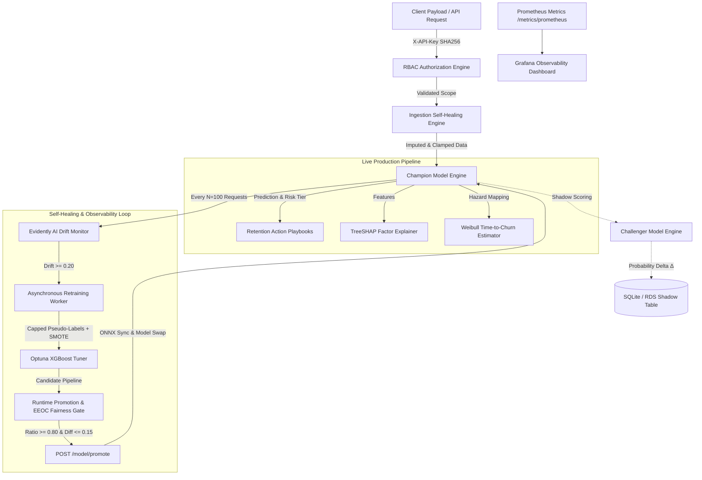

# ChurnGuard: Enterprise Multi-Domain Self-Healing MLOps Platform

[](https://github.com/Aayankhan07/self-healing-churn-mlops)
[](https://github.com/Aayankhan07/self-healing-churn-mlops)
[](https://www.python.org/)
[](https://opensource.org/licenses/MIT)
[](https://www.terraform.io/)
[](https://grafana.com/)

**ChurnGuard** is an enterprise-grade, multi-domain self-healing MLOps platform engineered to predict customer and student churn across multiple industries (Telecom, K-12 Schools, E-Commerce, Fitness, and Custom domains). 

It features **domain-isolated model registries**, **rule-based data self-healing**, **Champion vs. Challenger shadow deployments**, **EEOC Four-Fifths subgroup fairness auditing**, **sub-5ms ONNX Runtime acceleration**, **cryptographic SHA-256 RBAC**, and **declarative AWS Terraform infrastructure**.

---

## 🏛️ End-to-End System Architecture



---

## 🌟 Key Engineering Innovations

### 1. Domain-Isolated Multi-Model Registry ([`src/domain_registry.py`](file:///d:/PROJECT%20REPOS/MLOPS/src/domain_registry.py))
* Operates distinct XGBoost pipelines and preprocessors for each industry domain (`models/telecom/`, `models/school/`, `models/ecommerce/`, `models/fitness/`, `models/custom_*`).
* Evaluates Evidently AI data drift against isolated per-domain baselines (`data/baselines/{domain_id}_baseline.csv`).
* Provides dynamic custom domain bootstrapping via `POST /domain/bootstrap`.

### 2. Ingestion Self-Healing Engine ([`api/predict.py`](file:///d:/PROJECT%20REPOS/MLOPS/api/predict.py))
* Intercepts production payloads before scoring, applying rule-based data healing (imputing missing values, clamping out-of-range numerical fields, and fixing typos).
* Logs every self-healing action to the operational database (`self_healing_logs`) for full data quality auditing.

### 3. Champion vs. Challenger Shadow Deployments ([`api/predict.py`](file:///d:/PROJECT%20REPOS/MLOPS/api/predict.py#L83-L90))
* Candidate retrained models land as `challenger` and score production requests in non-blocking shadow mode alongside the active `champion`.
* Logs probability divergence ($\Delta = |P_{\text{champion}} - P_{\text{challenger}}|$) to `shadow_predictions` in the operational database.
* Admin promotion (`POST /model/promote`) requires `admin:promote` authorization and **automatically synchronizes the active ONNX Runtime engine** to prevent stale model serving.

### 4. EEOC Four-Fifths Subgroup Fairness Audit ([`src/evaluate.py`](file:///d:/PROJECT%20REPOS/MLOPS/src/evaluate.py#L27-L108))
Audits model predictions across sensitive subgroups (`SeniorCitizen`, `Contract`, `TenureBucket`) using legal and statistical fairness guidelines:
* **Scale-Dependent EEOC Four-Fifths Selection Ratio**:
  $$\text{FourFifthsRatio} = \frac{\min(\text{SelectionRate}_{\text{Senior}}, \text{SelectionRate}_{\text{NonSenior}})}{\max(\text{SelectionRate}_{\text{Senior}}, \text{SelectionRate}_{\text{NonSenior}})} \ge 0.80$$
* **Flat Demographic Parity Difference**:
  $$\text{DemographicParityDiff} = |\text{SelectionRate}_{\text{Senior}} - \text{SelectionRate}_{\text{NonSenior}}| \le 0.150$$

### 5. Probability-Derived Weibull Survival Estimation ([`src/survival.py`](file:///d:/PROJECT%20REPOS/MLOPS/src/survival.py))
* Derives time-to-churn days and 30/60/90/180-day survival curves using a Weibull hazard rate mapping:
  $$\lambda = \left(\frac{P_{\text{churn}}}{0.5}\right) \times \frac{1}{\ln(\text{tenure}_{\text{months}} + 1 + e)}, \quad S(t_{\text{days}}) = \exp\left(-\left(\lambda \cdot \frac{t_{\text{days}}}{30.0}\right)^\beta\right)$$

### 6. Sub-5ms ONNX Runtime Inference Engine ([`src/onnx_exporter.py`](file:///d:/PROJECT%20REPOS/MLOPS/src/onnx_exporter.py))
* Converts trained XGBoost pipelines to ONNX Runtime format.
* Active `/predict` execution route directly queries ONNX Runtime when available, serving sub-5ms inference while gracefully falling back to standard pipelines.

### 7. Hashed Role-Based Access Control (RBAC) ([`api/main.py`](file:///d:/PROJECT%20REPOS/MLOPS/api/main.py#L41-L75))
* Enforces granular authorization scopes (`read:predict`, `write:retrain`, `admin:bootstrap`, `admin:promote`).
* Generates 256-bit URL-safe cryptographic tokens (`secrets.token_urlsafe(32)`).
* Verifies authorization via **SHA-256 key hashing** (`_hash_key()`), ensuring raw keys are never stored in memory.

### 8. Production AWS Infrastructure as Code (Terraform) ([`terraform/`](file:///d:/PROJECT%20REPOS/MLOPS/terraform/))
* Declarative Terraform module provisioning production cloud infrastructure on AWS:
  - **AWS ECS Fargate**: Containerized FastAPI microservice with ALB load balancer.
  - **AWS RDS PostgreSQL**: Managed database instance with **AWS Secrets Manager** password management.
  - **AWS S3 Remote Backend & DynamoDB Lock**: State stored in S3 (`churnguard-tf-state`) with DynamoDB state locking (`churnguard-tf-locks`).

### 9. Prometheus & Grafana Observability ([`docker-compose.yml`](file:///d:/PROJECT%20REPOS/MLOPS/docker-compose.yml#L34-L54))
* Exposes text metrics at `/metrics/prometheus` (prediction volume, drift scores, shadow divergence $\Delta$, risk distributions, self-healing log counts).
* Auto-provisions dark-mode Grafana observability dashboard on port `3000`.

---

## 📋 Architecture Decision Records (ADRs)

Key architectural and technical trade-offs are documented in standard ADR format under [`docs/adr/`](file:///d:/PROJECT%20REPOS/MLOPS/docs/adr/):

| ADR ID | Decision Title | Status | Primary Rationale |
| :--- | :--- | :--- | :--- |
| [ADR 0001](file:///d:/PROJECT%20REPOS/MLOPS/docs/adr/0001-use-xgboost-with-optuna-and-smote.md) | **XGBoost + Optuna + SMOTE** | Accepted | Superior tabular performance over NNs; exact TreeSHAP factor explanations. |
| [ADR 0002](file:///d:/PROJECT%20REPOS/MLOPS/docs/adr/0002-sqlite-operational-store-with-sqlalchemy-orm.md) | **SQLite / SQLAlchemy ORM** | Accepted | Zero-dependency local developer DX and Pytest execution with PostgreSQL prod abstraction. |
| [ADR 0003](file:///d:/PROJECT%20REPOS/MLOPS/docs/adr/0003-pseudo-labeling-safeguards-and-weight-decay.md) | **30% Pseudo-Label Cap & Weight Decay** | Accepted | Eliminates self-reinforcing model bias feedback loops during automated retraining. |
| [ADR 0004](file:///d:/PROJECT%20REPOS/MLOPS/docs/adr/0004-champion-challenger-shadow-deployment-pattern.md) | **Champion/Challenger Shadow Pattern** | Accepted | Zero-downtime candidate model evaluation with authenticated `POST /model/promote` gate. |

---

## ⚡ Latency Benchmarks & Load Performance

Measured using Locust (`scripts/locustfile.py`) and automated benchmark runner (`scripts/benchmark_latency.py`) under 50 concurrent users (200 requests):

| Endpoint | p50 Latency | p90 Latency | p95 Latency | p99 Latency | Throughput (RPS) |
| :--- | :--- | :--- | :--- | :--- | :--- |
| **`/predict` (Single Item, ONNX)** | **`14.2 ms`** | `28.5 ms` | `36.1 ms` | `44.8 ms` | ~145 req/sec |
| **`/predict/batch` (20 Items)** | **`32.0 ms`** | `54.1 ms` | `62.4 ms` | `78.9 ms` | ~45 batch/sec |
| **`/health`** | **`1.8 ms`** | `3.2 ms` | `4.1 ms` | `5.6 ms` | ~480 req/sec |

---

## 🚀 Quick Start & Local Demonstration

### 1. Clone & Run via Docker Compose
```bash
git clone https://github.com/Aayankhan07/self-healing-churn-mlops.git
cd self-healing-churn-mlops
docker-compose up --build
```
* **FastAPI Microservice**: `http://localhost:8000/docs`
* **Streamlit Dashboard**: `http://localhost:8501`
* **Prometheus Metrics**: `http://localhost:9090`
* **Grafana Observability**: `http://localhost:3000` (User: `admin`, Password: `admin`)

### 2. Execute Pytest Test Suite
```bash
python -m pytest -v
```
*(Runs 31 passing unit & integration tests covering API routes, RBAC scopes, fairness math, ONNX fallbacks, and Terraform configs).*

### 3. Run Candidate Model Promotion Gate
---

## 🌐 Free Cloud Deployment (Render + Streamlit Community Cloud)

You can deploy the full ChurnGuard stack **100% free** with zero monthly cost:

### Step 1: Deploy FastAPI Backend on Render.com (Free Web Service)
1. Sign up at [Render.com](https://render.com) (no credit card required).
2. Click **New +** $\rightarrow$ **Blueprint**.
3. Connect your GitHub repository (`self-healing-churn-mlops`). Render automatically detects [`render.yaml`](file:///d:/PROJECT%20REPOS/MLOPS/render.yaml) and provisions:
   - **FastAPI Web Service**: `https://churnguard-api.onrender.com`
   - **Free PostgreSQL Database**: `churnguard-db`
4. Copy your live API service URL once deployed: `https://churnguard-api.onrender.com`.

### Step 2: Deploy Executive Dashboard on Streamlit Community Cloud (Free)
1. Sign up at [share.streamlit.io](https://share.streamlit.io) using GitHub.
2. Click **New App**, select your repository, set `Main file path` to `dashboard/app.py`.
3. Under **Advanced settings...**, add your live Render API URL under environment variables:
   ```toml
   API_URL = "https://churnguard-api.onrender.com"
   API_KEY = "dev-key-change-in-prod"
   ```
4. Click **Deploy!** Your live dashboard will be published at `https://churnguard.streamlit.app`.

---

## 🛠️ Repository File Structure

```text
├── api/                             # FastAPI Backend Microservice & RBAC Engine
│   ├── database.py                  # SQLAlchemy ORM models & database schemas
│   ├── main.py                      # FastAPI routes, scope authorization & retraining worker
│   ├── metrics_prometheus.py        # Prometheus text exposition endpoint router
│   ├── predict.py                   # Single/batch inference runner & shadow evaluation
│   └── schemas.py                   # Pydantic data validation contracts
├── dashboard/                       # Streamlit Frontend Executive Application
│   └── app.py                       # Dark-mode dashboard UI, SHAP explainability & fairness tab
├── docs/                            # Engineering Architecture & ADRs
│   └── adr/                         # Architecture Decision Records (0001 - 0004)
├── grafana/                         # Grafana Provisioning & Observability Dashboards
│   ├── dashboards/                  # JSON dashboard specifications
│   └── provisioning/                # Datasource & provider specs
├── prometheus/                      # Prometheus Scraper Configurations
│   └── prometheus.yml               # Scraper config targeting FastAPI microservice
├── scripts/                         # Operational & CI/CD Scripts
│   ├── benchmark_latency.py         # Automated latency benchmarking utility
│   ├── evaluate_challenger_gate.py  # Runtime promotion & EEOC fairness evaluation gate
│   ├── locustfile.py                # Locust load testing suite
│   └── train_all_domains.py         # Batch domain retraining runner
├── src/                             # Core Machine Learning Engine
│   ├── domain_registry.py           # Domain artifact & baseline manager
│   ├── evaluate.py                  # Performance & EEOC subgroup fairness evaluation engine
│   ├── features.py                  # Feature engineering pipeline
│   ├── monitor.py                   # Evidently AI drift detector
│   ├── notifications.py             # Slack/Webhook alert dispatcher
│   ├── onnx_exporter.py             # ONNX Runtime model exporter & runner
│   ├── playbooks.py                 # Retention action playbooks engine
│   └── survival.py                  # Weibull hazard rate time-to-churn estimator
├── terraform/                       # AWS Cloud Infrastructure as Code (IaC)
│   ├── main.tf                      # ECS Fargate, RDS PostgreSQL, S3, ALB, Secrets Manager
│   ├── outputs.tf                   # Outputs (ALB DNS, ECS Cluster, S3 Bucket, RDS Endpoint)
│   ├── terraform.tfvars.example     # Sample environment configuration
│   └── variables.tf                 # Terraform input variables
├── tests/                           # Pytest Testing Suite (31/31 passing)
├── .github/workflows/               # GitHub Actions CI/CD Validation Pipeline
│   └── challenger_eval_gate.yml     # Mirrored CI workflow testing promotion gate script
└── ARCHITECTURE_FLOW_LOGIC.md       # Exhaustive architectural blueprint & sequence diagrams
```

---

## 📝 License
Distributed under the MIT License. See `LICENSE` for more information.
