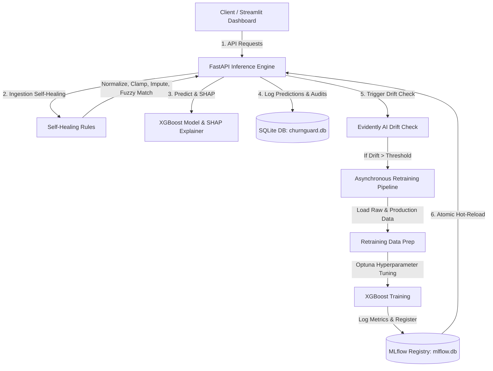

# 🛡️ ChurnGuard: Self-Healing MLOps Customer Churn Platform

ChurnGuard is a business-facing MLOps platform that predicts which customers are at risk of churning, explains why using SHAP feature importances, monitors input data drift via Evidently AI, and dynamically heals data anomalies in production to prevent pipeline crashes. If significant data drift is detected, ChurnGuard triggers an automated self-healing retraining loop with Optuna tuning and XGBoost, atomically hot-reloading the newly trained model in memory.

---

## 🏗️ Architecture Overview

The system is designed as a modular, decoupled platform where the FastAPI backend handles scoring, logging, monitoring, and self-healing, while the Streamlit dashboard provides a premium executive view.



---

## ✨ Core Features

1. **Self-Healing Data Pipeline**:
   * **Ingestion-Level Healing**: Implements rule-based correction (clamping negative tenures, imputing missing charges using medians, norming categorical variables) and dynamic typo resolution using string similarity metrics (`difflib.get_close_matches`) on the API Gateway.
   * **Retraining-Level Healing**: Automatically cleans production data and logs all correction actions as data quality events prior to appending records to the training set.
2. **Asynchronous Retraining & Drift Alerts**:
   * Measures dataset drift continuously. If the drift score exceeds the threshold, it triggers an asynchronous retraining thread.
   * Performs hyperparameter optimization with Optuna and registers the best model in MLflow.
   * Atomically reloads the new model in-memory with thread-safe locks (`threading.Lock()`).
3. **Interactive Dashboard**:
   * Sleek, high-fidelity dark-mode user interface.
   * Executive KPIs (total customers scored, risk segments, churn distribution).
   * Searchable customer table with SHAP waterfall explanations.
   * Live model metrics (F1, AUC, PR curve) and downloadable HTML drift reports.
   * Self-healing monitoring console showing real-time data corrections and manual retraining triggers.

---

## 📁 Repository Structure

```text
├── .github/                 # GitHub workflows
├── alembic/                 # Database migration configurations
├── alembic.ini              # Alembic environment setup
├── api/                     # FastAPI backend application
│   ├── database.py          # SQLAlchemy models and SQLite connection helpers
│   ├── drift.py             # Evidently AI report generators
│   ├── main.py              # Application entrypoint & self-healing ingestion logic
│   ├── predict.py           # Single & batch prediction runners
│   └── schemas.py           # Pydantic data schemas
├── dashboard/               # Streamlit application
│   └── app.py               # Dark mode executive layout & visualization code
├── data/                    # Local storage for raw and processed datasets
├── dvc.yaml                 # DVC data preprocessing and training pipeline
├── metrics/                 # Outputs of evaluation stages (JSON)
├── mlflow.db                # SQLite database for MLflow runs
├── models/                  # Joblib files for models and preprocessors
├── params.yaml              # Hyperparameter and monitoring configuration thresholds
├── reports/                 # Exported HTML reports for data drift analysis
├── src/                     # Raw Python pipelines
│   ├── data_prep.py         # Split and load training splits
│   ├── evaluate.py          # Model evaluation and SHAP calculations
│   ├── features.py          # Feature engineering and encoders
│   └── train.py             # XGBoost/Optuna model training script
└── tests/                   # Pytest testing suite
```

---

## ⚡ Quickstart Guide

### Option 1: Docker Compose (Recommended)

Start the entire stack (FastAPI Backend, Streamlit Dashboard, and MLflow Tracking Server) with a single command:

```powershell
docker-compose up --build
```

Access the services at:
* **Streamlit Dashboard**: `http://localhost:8501`
* **FastAPI Backend (Swagger Docs)**: `http://localhost:8000/docs`
* **MLflow Tracking UI**: `http://localhost:5000`

---

### Option 2: Local Development Setup

#### 1. Setup Virtual Environment & Install Dependencies
Ensure you are using **Python 3.10+** (tested and optimized for Python 3.12 compatibility):

```powershell
# Create venv
python -m venv .venv
.venv\Scripts\activate

# Install dependencies
pip install -r requirements.txt
```

#### 2. Run the FastAPI Application
```powershell
# Run backend on port 8000
uvicorn api.main:app --reload --host 127.0.0.1 --port 8000
```

#### 3. Run the Streamlit Dashboard
Open a new shell, activate the environment, and run:
```powershell
# Run frontend dashboard
streamlit run dashboard/app.py
```

---

## 🔌 API Documentation

| Method | Endpoint | Description | Auth Required |
|:---|:---|:---|:---|
| `GET` | `/health` | Check backend availability & model registry status | No |
| `GET` | `/metrics` | Fetch live model metrics (F1/AUC-ROC) from MLflow or local files | No |
| `POST` | `/predict` | Predict churn for a single customer (applies self-healing) | Yes (`X-API-Key`) |
| `POST` | `/predict/batch` | Bulk predict churn for a batch of customers | Yes (`X-API-Key`) |
| `POST` | `/upload` | Accept CSV file, score all entries, return output CSV | Yes (`X-API-Key`) |
| `GET` | `/drift/status` | Fetch latest Evidently AI dataset drift summary | No |
| `GET` | `/drift/report` | Download the complete HTML report of data drift | No |
| `GET` | `/self-healing/logs` | Fetch audit logs of ingestion and retraining fixes | No |
| `POST` | `/self-healing/trigger-retrain` | Manually run the training pipeline asynchronously | No |

---

## 🛠️ Data Quality & Self-Healing Logic

To prevent pipeline breaks from bad data inputs, ChurnGuard runs the incoming dictionary through `heal_customer_data` before validation:

* **Numeric Fields**:
  * Clamps negative `tenure` values to `0`.
  * Imputes missing `MonthlyCharges` with the median (`70.35`).
  * Recomputes `TotalCharges` dynamically as `MonthlyCharges * tenure` when values are missing or violate constraints.
* **Categorical Fields**:
  * Normalizes variations of `SeniorCitizen` (e.g. `"Yes"`, `"y"`, `"true"`, `1.0`) to binary integer formats (`0` or `1`).
  * Uses fuzzy string matching to correct typos in user choices (e.g., mapping `"Electrnic check"` to `"Electronic check"`).

All occurrences are logged to the database's `self_healing_events` table and displayed on the dashboard console.

---

## 🧪 Testing & Verification

Run the test suite containing unit tests for pipeline preprocessing, integration tests for API endpoints, and validation of database-level self-healing during retraining:

```powershell
pytest tests/
```
