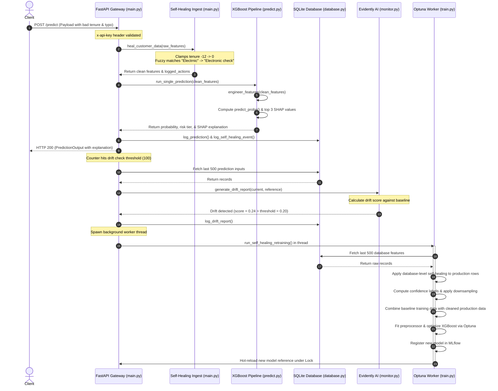

# 🛡️ ChurnGuard: Deep Codebase Explanation & Architectural Guide

This document provides an exhaustive, production-grade review of the **ChurnGuard** customer churn prediction codebase. It is written to serve as a complete reference for rewriting the system from scratch, defending its implementation choices in high-level system design and MLOps interviews, and identifying non-obvious failure modes, race conditions, and optimizations.

---

## 📁 Repository Structure

```text
├── .github/                 # CI/CD Workflows
├── alembic/                 # Relational database schema migration control
├── alembic.ini              # Alembic configuration variables
├── api/                     # FastAPI backend microservice
│   ├── database.py          # SQLAlchemy SQLite connection and query methods
│   ├── drift.py             # Evidently AI drift wrapper
│   ├── main.py              # Main API service entry point & self-healing logic
│   ├── predict.py           # Single/batch model inference & SHAP computations
│   └── schemas.py           # Pydantic v2 schemas for request validation
├── dashboard/               # Streamlit frontend service
│   └── app.py               # Dark-mode dashboard visualization
├── data/                    # Raw & processed data folders (DVC tracked)
├── dvc.yaml                 # DVC lifecycle stage declarations
├── metrics/                 # Performance indicators (JSON outputs)
├── mlflow.db                # SQLite database for MLflow runs
├── models/                  # Serialized XGBoost pipelines (.joblib)
├── params.yaml              # Hyperparameter and operational configurations
├── reports/                 # Auto-generated Evidently HTML drift reports
├── src/                     # Raw Python pipelines
│   ├── data_prep.py         # Data cleaning and training split logic
│   ├── evaluate.py          # Model testing metrics & SHAP factors
│   ├── features.py          # Custom feature engineering pipeline
│   └── train.py             # Optuna optimization and training executor
└── tests/                   # Pytest testing suite (unit & integration)
```

---

## 🏛️ Architectural Overview

ChurnGuard is an autonomous, self-healing MLOps system designed to predict customer churn, explain individual outcomes, monitor input distribution shift, and recover from bad quality data inputs in production.

The architecture consists of a **FastAPI backend** that acts as the prediction gateway, storing transactions in a **SQLite database**. An **Evidently AI** monitor analyzes incoming features. When data drift exceeds a defined threshold, the API triggers an asynchronous **retraining worker thread**. This worker runs **Optuna** to optimize an **XGBoost** model (using **SMOTE** to handle class imbalance), registers the updated model in **MLflow**, and atomically hot-reloads it back into the FastAPI gateway using thread-safe container references. The business user interacts with the system via a **Streamlit Web Dashboard** connected exclusively to the API endpoints.

---

## 📄 File-by-File Technical Deep Dive

### 1. Ingestion Entrypoint: [api/main.py](file:///d:/PROJECT%20REPOS/MLOPS/mlops-project/api/main.py)

#### Purpose
Acts as the central gateway for incoming requests, executing the ingestion self-healing data transformations, running single/batch inference, logging telemetry, and executing asynchronous model retraining when data drift is detected.

#### Line-by-Line Code Walkthrough
* **Imports (Lines 5–35)**: Imports system paths, multi-threading, custom Pydantic schemas, database interfaces, feature engineering methods, and background trainers. The use of `sys.path.append(str(Path(__file__).resolve().parents[1]))` ensures that root modules (`src`) can be imported regardless of execution context.
* **Global Variables & FastAPI Init (Lines 36–45)**:
  * `START_TIME = time.time()`: Tracks application uptime.
  * `API_KEY`: Extracted from environment variables; defaults to `"dev-key-change-in-prod"`.
  * `app = FastAPI(...)`: Initializes the FastAPI application instance.
* **Security Middleware (Lines 46–49)**:
  * `verify_api_key(x_api_key: str = Header(...))`: Extracts the API key from request headers. Throws a `403 Forbidden` error if it doesn't match `API_KEY`. Designed as a FastAPI dependency for modular route-level security.
* **Startup Event (Lines 51–106)**:
  * `@app.on_event("startup")`: Executes initialization logic before receiving requests.
  * `mlflow.set_tracking_uri(...)`: Connects FastAPI to the MLflow logging backend.
  * `mlflow.sklearn.load_model(...)`: Attempts to fetch the `Production` model from the MLflow Registry.
  * **Fallback Block**: If MLflow is unreachable, it attempts to load a localized copy (`models/model.joblib`). This design guarantees high availability; model registry outages will not take down prediction services.
  * **Thread-safe Hot-Reload State**: Sets up `app.state.model_lock = threading.Lock()` and stores model references in a dictionary. A reader-writer concurrency lock prevents incoming request threads from accessing a partially updated model during hot-reloads.
  * `app.state.reference_data`: Loads `train.csv` into memory to act as the baseline reference dataset for Evidently AI drift calculations.
* **Ingestion Se  * **Numeric Clamping**: Clamps `tenure < 0` to `0`, and checks that `TotalCharges >= MonthlyCharges` when `tenure > 0`. If violated, it calculates `TotalCharges = MonthlyCharges * tenure` to restore logic. Missing fields are imputed using median figures.
  * **Categorical Normalization**: Converts string equivalents (`"Yes"`, `"y"`, `"true"`) to binary `SeniorCitizen` format (`0` or `1`).
  * **String Similarity Typo Correction**: Utilizes Python's standard `difflib.get_close_matches` with a threshold cutoff of `0.6` to fuzzy-match and correct structural typos in categorical features (e.g. correcting `"Electrnic check"` to `"Electronic check"`).
* **API Route handlers (Lines 231–364)**:
  * `GET /health`: Returns application status, uptime, and model version.
  * `GET /metrics`: Retrieves the latest model's F1 score and AUC-ROC directly from the MLflow Production run or local evaluation fallback files.
  * `POST /predict`: Scores a single customer. It applies ingestion-level healing, logs the corrections in the DB, generates predictions, increments a prediction counter, and triggers drift analysis if `counter % drift_check_every == 0`.
  * `POST /predict/batch`: Scores multiple rows in a single session, increments the prediction counter, and triggers drift analysis if a checking boundary is crossed.
  * `POST /upload`: Accepts CSV files, runs predictions on all records, writes the output to a temporary CSV on disk, and returns a `FileResponse` for instant browser download.
  * `GET /drift/status` & `GET /drift/report`: Interrogates SQLite for the latest drift assessments and returns either a status payload or the compiled Evidently HTML output.
* **Drift Check Orchestration (Lines 365–433)**:
  * `_run_drift_check()`: Pulls the last 500 prediction inputs from SQLite, converts them back to a dataframe, and generates an Evidently report.
  * If drift is detected, it triggers a background worker thread (`run_self_healing_retraining`) to avoid blocking the client request thread.
* **Retraining Pipeline (Lines 434–643)**:
  * `run_self_healing_retraining(app_ref)`: Asynchronously merges reference training data with recent production records from SQLite.
  * **Retraining Data Cleansing**: Iterates through database inputs, running `heal_customer_data` on each record to ensure bad historical inputs do not corrupt training.
  * **Pseudo-Labeling (Confidence Thresholding)**: Assigns labels to unlabelled production rows if model prediction probability is high (predict $\ge 0.85 \rightarrow 1$, predict $\le 0.15 \rightarrow 0$) with a lower sample weight ($0.5$). It downsamples pseudo-labels to prevent them from exceeding 20% of the training batch size.
  * **Filesystem Swap**: Saves combined datasets to `data/processed/train_retrain.csv` (non-destructive path), executes `train.py` programmatically, and then cleans up the temporary file.
  * **Atomic Hot-Reloading**: Under a `threading.Lock()`, updates the reference inside `app.state` to point to the new XGBoost classifier and preprocessor.

#### System Connectivity
* **Called By**: Streamlit Dashboard, external API clients.
* **Calls**: `api/database.py` (logging/queries), `api/predict.py` (inference runs), `src/train.py` (retraining loop), `api/drift.py` (drift metrics).
* **Data Flow**: Accepts raw customer dict $\rightarrow$ Outputs prediction probabilities, SHAP drivers, and model metadata.

#### Design Patterns & Architectural Choices
* **Hot-Reloadable Singleton Cache**: FastAPI's `app.state` behaves as a thread-safe registry cache storing the model pipeline. It implements thread-level synchronization via `threading.Lock()` to prevent race conditions during model swapping.
* **Worker Thread Pattern**: Asynchronous retraining runs in an independent thread so API clients do not experience connection timeouts during model fitting.

> [!IMPORTANT]
> **🚀 Fixed Design Mitigations & Security Enhancements**
> 1. **Crash-Safe Retraining**: Retraining now writes merged production data to a non-destructive path `data/processed/train_retrain.csv` and sets the `TRAIN_DATA_PATH` env variable instead of overwriting the version-controlled `train.csv` file. This guarantees that model crashes or unexpected container exits do not corrupt baseline datasets.
> 2. **Atomic Counter & Thread-Safe Locking**: Prediction increments and modulo checks are protected under `app.state.model_lock`. The drift check `_run_drift_check` is executed in a non-blocking background thread with its own database session (`SessionLocal()`), preventing request threads from stalling or causing transaction collisions.
> 3. **Active Baseline Drift Reload**: The data baseline used for Evidently AI (`app.state.reference_data`) is automatically refreshed with the newly combined training dataset upon model hot-reloading. This ensures that subsequent drift calculations correctly evaluate against the new retrained baseline.
> 4. **Strict API Key Validation**: In production contexts (`ENV=production`), the application raises a loud startup exception (`ValueError`) if `API_KEY` is missing, rather than silently falling back to the insecure development key.
> 5. **Confirmation Bias Prevention Loop**: Capped consecutive pseudo-label retraining cycles to a maximum of **3**. If no new ground-truth labels are resolved in the database logs across three consecutive retraining triggers, retraining is skipped to prevent reinforcing model errors.

---

### 2. Core Inference Engine: [api/predict.py](file:///d:/PROJECT%20REPOS/MLOPS/mlops-project/api/predict.py)

#### Purpose
Executes feature transformation, applies the trained model to generate predictions, assigns risk categories, computes local model explanations (SHAP), and records results in the backend database.

#### Walkthrough
* **Imports (Lines 5–16)**: Standard data utilities, SQLite logging helper, Pydantic schemas, and SHAP calculation utilities from `src/evaluate.py`.
* **Thresholds (Lines 18–26)**:
  * `RISK_THRESHOLDS = {"low": 0.35, "high": 0.65}`: Establishes boundaries for risk tiers. Low/Medium boundary is at 0.35, Medium/High is at 0.65. Categorization allows business users to quickly prioritize retention budgets.
* **Data Hashing (Lines 29–31)**:
  * `hash_input(data: dict) -> str`: Generates a SHA256 signature of sorted customer attributes (excluding identifiers). Allows identifying repeated prediction queries and auditing data patterns without storing plain text Personally Identifiable Information (PII), supporting compliance (e.g., GDPR).
* **Prediction Flow (Lines 34–94)**:
  * `run_single_prediction(...)`: Orchestrates the inference pipeline.
  * **Dynamic Thread-Safe Model Extraction**: Extracts the active model, preprocessor, and version tag from the FastAPI application state using a thread lock to ensure consistency.
  * **Feature Engineering**: Calls `engineer_features(df)` to dynamically calculate custom derived variables.
  * **Inference Calculation**: Invokes `predict_proba(df)[0][1]` to extract the raw churn probability (float value between 0 and 1).
  * **SHAP Interpretation**: Invokes `get_top_shap_factors` to calculate local feature impact scores. If SHAP calculation fails (e.g. tree structure mismatch), it returns an empty list, ensuring prediction delivery is not interrupted by explanation failures.
  * **Database Persistence**: Serializes customer characteristics and self-healing actions, writing them to SQLite.

#### System Connectivity
* **Called By**: `api/main.py` (predict route handlers).
* **Calls**: `src/features.py` (feature calculations), `src/evaluate.py` (SHAP scores), `api/database.py` (database logs).
* **Data Flow**: Accepts raw customer dict and database session $\rightarrow$ Returns a `PredictionOutput` Pydantic object.

#### Design Patterns & Architectural Choices
* **Graceful Degradation Pattern**: Encapsulating SHAP factor calculation in a try-except block prevents non-essential visualization features from crashing the core model inference pipeline.

---

### 3. Request Validation: [api/schemas.py](file:///d:/PROJECT%20REPOS/MLOPS/mlops-project/api/schemas.py)

#### Purpose
Defines Pydantic models for incoming JSON payloads and API responses, performing strict data validation before data reaches the XGBoost model.

#### Walkthrough
* **Imports (Lines 5–7)**: Imports Pydantic v2 core features (`BaseModel`, `Field`, `field_validator`) and Python typing indicators.
* **CustomerInput Schema (Lines 10–33)**:
  * Defines features with strict boundaries. For example, `tenure: int = Field(..., ge=0)` and `MonthlyCharges: float = Field(..., gt=0)`.
  * Categorical features are defined as literal lists (e.g. `Contract: Literal["Month-to-month", "One year", "Two year"]`). This forces validation directly at the API gateway level, rejecting arbitrary inputs.
* **Validation Rule (Lines 35–42)**:
  * `total_ge_monthly(cls, v, info)`: A field validator verifying that `TotalCharges >= MonthlyCharges` if `tenure > 0`. It uses Pydantic's `info.data` dictionary to access previously validated fields.
* **Telemetry and Response Schemas (Lines 45–100)**:
  * `ShapFactor`: Defines local impact metadata.
  * `PredictionOutput`: Defines output structures, including healed action logs.
  * `LaxBatchInput`: Bypasses strict schema checks during ingestion by accepting a list of dictionaries, allowing the self-healing pipeline to correct issues *before* validating against the strict `CustomerInput` model.

#### System Connectivity
* **Called By**: `api/main.py`, `api/predict.py`.
* **Data Flow**: Acts as a validation layer for data entering or leaving the API.

> [!WARNING]  
> **⚠️ Note: Order-Dependent Field Validation**
> Pydantic v2 validates fields in the order they are defined. In `CustomerInput`, `TotalCharges` is defined on line 14, after `tenure` (line 12) and `MonthlyCharges` (line 13). If a developer moves `TotalCharges` to line 11, `info.data.get("MonthlyCharges")` will return `None` when validation executes, throwing an error. This order-dependency is fragile and should be noted during codebase refactoring.

---

### 4. Storage & Persistence: [api/database.py](file:///d:/PROJECT%20REPOS/MLOPS/mlops-project/api/database.py)

#### Purpose
Configures the SQLite database engine using SQLAlchemy ORM, managing schemas for predictions, drift logs, and self-healing actions.

#### Walkthrough
* **Connection Initialization (Lines 9–13)**:
  * `connect_args={"check_same_thread": False}`: Allows SQLAlchemy to share database connection resources across multiple FastAPI request threads. SQLite, by default, restricts connection sharing to a single thread; disabling this constraint is necessary for multi-threaded API architectures.
  * `SessionLocal`: Pre-configures a factory for database sessions.
* **Table Models (Lines 15–45)**:
  * `Prediction`: Stores predictions, probabilities, model versions, and custom inputs/healed actions as JSON strings.
  * `SelfHealingLog`: Tracks pipeline corrections and retraining events.
  * `DriftReport`: Logs Evidently AI dataset drift outputs.
* **Session Lifecycle (Lines 51–56)**:
  * `get_db()`: A generator yielding database sessions. It is wrapped in a try-finally block to guarantee that sessions are closed after a request finishes, preventing SQLite lock timeouts and database connection leaks.

#### System Connectivity
* **Called By**: `api/main.py` (FastAPI router endpoints).
* **Calls**: SQLite backend engine.
* **Data Flow**: Writes transaction logs and reads historic metrics.

> [!WARNING]
> **⚠️ Note: SQLite Concurrency and Scaling Limits**
> SQLite is a file-based database that serializes all write operations using database-level locking. While `connect_args={"check_same_thread": False}` allows multiple threads to read concurrently, any concurrent writes (such as logging predictions and self-healing telemetry under high load) are queued or blocked. This is acceptable for portfolio projects and local testing, but highly concurrent enterprise deployments should replace this layer with a robust client-server relational database such as **PostgreSQL**.

---

### 5. Custom Feature Engineering: [src/features.py](file:///d:/PROJECT%20REPOS/MLOPS/mlops-project/src/features.py)

#### Purpose
Applies business logic to transform raw categorical and numeric inputs into feature arrays for training and inference, ensuring consistency across training and serving environments.

#### Walkthrough
* **Feature Lists (Lines 16–30)**:
  * `NUMERIC_FEATURES` & `CATEGORICAL_FEATURES`: Explicit lists that control how the ColumnTransformer routes columns.
* **Engineering logic (Lines 33–51)**:
  * `engineer_features(df: pd.DataFrame) -> pd.DataFrame`: Computes custom features:
    * `tenure_group`: Groups customers by duration (e.g., `0-1yr`, `1-2yr`) using `pd.cut`. This helps tree-based models split on tenure intervals more effectively.
    * `services_count`: Summarizes active services by checking matching column values.
    * `charges_per_month_ratio`: Calculates monthly spend relative to tenure + 1 (the +1 offset prevents division-by-zero errors for new customers).
* **ColumnTransformer (Lines 54–67)**:
  * `build_preprocessor()`: Configures an Scikit-learn preprocessor. Missing numeric values are resolved using the median, and categorical variables are resolved with the most frequent value before applying `OneHotEncoder(handle_unknown="ignore", sparse_output=False)`.
  * Setting `handle_unknown="ignore"` prevents the pipeline from throwing errors if the production API encounters new categorical categories not present in the training set.

#### System Connectivity
* **Called By**: `src/train.py`, `src/evaluate.py`, `api/predict.py`.
* **Data Flow**: Transforms raw DataFrames into processed numerical arrays.

---

### 6. Optuna Model Training Pipeline: [src/train.py](file:///d:/PROJECT%20REPOS/MLOPS/mlops-project/src/train.py)

#### Purpose
Executes model training by running hyperparameter tuning via Optuna, logging results to MLflow, and saving the output classifier and preprocessor pipelines.

#### Walkthrough
* **MLflow Tracking Setup (Lines 34–43)**:
  * Attempts to establish a connection with the central MLflow server (`http://localhost:5000`). If offline, it automatically redirects metrics to a local database (`sqlite:///mlflow.db`), preventing tracking failures from stopping the training process.
* **Objective Function (Lines 53–72)**:
  * Defines the search space for Optuna trials (e.g. `n_estimators`, `max_depth`, `learning_rate`).
  * **Pipeline Architecture**: Builds an Imbalanced-learn pipeline combining the preprocessor, **SMOTE** (Synthetic Minority Over-sampling Technique) to address class imbalance, and the **XGBoost** classifier.
  * Optimizes the validation F1-score to balance precision and recall.
* **Tuning Execution (Lines 74–79)**:
  * Runs 30 optimization trials to identify the best parameters.
* **MLflow Registration & Serialization (Lines 80–115)**:
  * Fits the final pipeline on all training data, records parameters and metrics to MLflow, and saves the trained components (`models/model.joblib` and `models/preprocessor.joblib`).
  * Registers the trained model in the MLflow Model Registry as `churn_model`.

#### System Connectivity
* **Called By**: DVC CLI, `api/main.py` (retraining thread).
* **Calls**: `src/features.py`, `src/evaluate.py`.

---

### 7. Evaluation & Local Explainer: [src/evaluate.py](file:///d:/PROJECT%20REPOS/MLOPS/mlops-project/src/evaluate.py)

#### Purpose
Generates performance metrics on test splits, builds ROC curves, and calculates SHAP values to explain individual predictions.

#### Walkthrough
* **Metrics Calculation (Lines 21–30)**:
  * Calculates `F1`, `AUC-ROC`, `AUC-PR`, `Precision`, and `Recall`.
* **Feature Name Mapping (Lines 33–41)**:
  * `get_feature_names(preprocessor)`: Extracts feature names after encoding, parsing Scikit-learn's `ColumnTransformer` to map indices back to feature names.
* **SHAP Calculation (Lines 44–81)**:
  * `get_top_shap_factors(...)`: Uses `shap.TreeExplainer` on the XGBoost classifier for fast SHAP value computation.
  * **OHE Value Resolution**: Maps One-Hot Encoded feature columns back to original feature names and customer raw values using prefix matching against `X_raw.columns`. This ensures that explanations (e.g. `Contract`) display actual category values (e.g. `Month-to-month`) instead of placeholder `"N/A"` strings.
  * Sorts values by absolute impact size, returning the top 3 features and their influence directions (`increases_risk` or `decreases_risk`).

#### System Connectivity
* **Called By**: `src/train.py`, `api/predict.py`.
* **Calls**: `src/features.py`.

---

### 8. Drift Monitoring: [src/monitor.py](file:///d:/PROJECT%20REPOS/MLOPS/mlops-project/src/monitor.py)

#### Purpose
Generates dataset drift reports using Evidently AI to compare active production data against the training baseline.

#### Walkthrough
* **Evidently Load Safeguard (Lines 15–23)**:
  * Imports `evidently.report` inside a try-except block. If compatibility issues occur under certain Python versions, the system flags `EVIDENTLY_AVAILABLE = False` and runs a mock report fallback, preventing application startup failures.
* **Drift Check (Lines 25–70)**:
  * `generate_drift_report(current_data, reference_data)`: Compares active production inputs against reference data using Evidently AI's `DataDriftPreset`.
  * Computes the share of drifted columns and writes the diagnostic dashboard as an HTML file in `reports/`.

#### System Connectivity
* **Called By**: `api/main.py` (via `api/drift.py`).
* **Data Flow**: Accepts current pandas DataFrame $\rightarrow$ Returns drift status dict and HTML report path.

---

### 9. Dataset Initialization: [src/data_prep.py](file:///d:/PROJECT%20REPOS/MLOPS/mlops-project/src/data_prep.py)

#### Purpose
Cleans raw CSV files, converts the target column to binary format, and splits the data into train, validation, and test datasets.

#### Walkthrough
* **Data Cleaning (Lines 22–34)**:
  * Coerces `TotalCharges` to numeric, handles spaces, and imputes null values using the median.
  * Converts the text target `Churn` (`"Yes"` / `"No"`) into integer formats (`1` / `0`).
* **Stratified Split (Lines 36–55)**:
  * Split data into train, validation, and test datasets.
  * Uses `stratify` to maintain the ratio of churned to non-churned customers across all splits, preventing class distribution bias in validation and test partitions.

#### System Connectivity
* **Called By**: DVC CLI pipeline.
* **Data Flow**: Reads `data/raw/telco_churn.csv` $\rightarrow$ Outputs split CSVs to `data/processed/`.

---

### 10. Operational Dashboard: [dashboard/app.py](file:///d:/PROJECT%20REPOS/MLOPS/mlops-project/dashboard/app.py)

#### Purpose
Provides an executive dashboard interface, presenting risk analytics, customer profiles, upload options, and model health metrics.

#### Walkthrough
* **UI Themes (Lines 18–121)**:
  * Configures a custom dark-mode theme utilizing CSS injection (`st.markdown("<style>...", unsafe_allow_html=True)`). Standardizes fonts, card containers, scroll bars, and gradient headers.
* **Navigation (Lines 123–128)**:
  * `st.sidebar.radio`: Provides navigation across five areas: "Overview", "Customers", "Upload & Score", "Model Health", and "Self-Healing Console".
* **Data Retrieval (Lines 130–157)**:
  * Communicates with FastAPI via `requests.get` or `requests.post`. Bypasses direct database calls to maintain a clean MVC architecture.
  * Displays warnings if the backend goes offline or if data drift is detected.
* **Pages Implementation (Lines 160–677)**:
  * **Overview**: Renders KPI cards (customer counts, risk distributions) and historical charts.
  * **Customers**: Search customer IDs and render SHAP waterfall charts.
  * **Upload & Score**: Provides a file uploader for CSV scoring.
  * **Model Health**: Shows training metrics and embeds the Evidently AI drift report.
  * **Self-Healing Console**: Visualizes data cleaning event logs and provides a button to trigger manual model retraining.

#### System Connectivity
* **Called By**: User browser.
* **Calls**: FastAPI gateway endpoints.

---

## ⚙️ Configuration & Infrastructure

### 1. [params.yaml](file:///d:/PROJECT REPOS/MLOPS/mlops-project/params.yaml)
Stores pipeline parameters, ensuring code logic is decoupled from configurations:
* `data`: Configures split sizes and random seeds.
* `model`: Configures XGBoost parameters (e.g. `n_estimators`, `max_depth`, `learning_rate`) and training details (e.g. Optuna search trial count).
* `thresholds`: Sets risk tier boundaries and drift trigger points.
* `api`: Sets upload limits and drift monitoring frequencies.

### 2. [Dockerfile](file:///d:/PROJECT REPOS/MLOPS/mlops-project/Dockerfile)
Builds a lightweight Python container for serving:
* Uses a `python:3.10-slim` base image.
* Installs `build-essential` for compilation, copies project files, installs dependencies, and configures Uvicorn on port `8000`.

### 3. [docker-compose.yml](file:///d:/PROJECT REPOS/MLOPS/mlops-project/docker-compose.yml)
Orchestrates multi-container services:
* **api**: Builds the local Dockerfile, links dependencies, and connects to the database.
* **mlflow**: Launches the MLflow tracking server on port `5000`.
* **dashboard**: Launches the Streamlit dashboard on port `8501`.

---

## 🔄 End-to-End Prediction and Self-Healing Flow Trace

The diagram below details the step-by-step sequence of events when a client submits a customer record with data quality issues:


